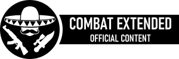

## Media Pack

This folder contains PNG images and Inkscape SVG vector source graphic files for the following:

* Mod preview images (CE, CE Guns, CE Melee)
* Badges (CE Official Content, CE Compatible)
* A large CE logo (the same as used on the official Discord channel)
* Headings for Steam Workshop description subsections

The font used is Bahnschrift, with a font weight of 600 and 75 (%) width. The TrueType Font (TTF) file is also included in the media folder.

### For CE Maintainers

Include the following badge graphic in your mod descriptions, to identify that your mod is part of the official "Core" Combat Extended mod family (e.g. CE Guns, CE Melee).

_(Note: Right-click on this image and select `Copy Image Location`, so that you are always referencing the latest version of the badge on the GitHub repo)_

### For Third-Party Mod Authors

Include the following badge graphic in your mod descriptions, to identify that your mod is compatible with Combat Extended.

_(Note: Right-click on this image and select `Copy Image Location`, so that you are always referencing the latest version of the badge on the GitHub repo)_

